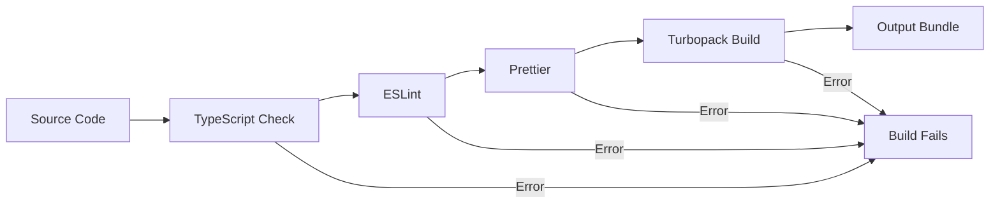

# 🏗️ Arquitetura Técnica

Documentação técnica detalhada da arquitetura e decisões técnicas do projeto.

## 📋 Índice

- [🎯 Visão Geral da Arquitetura](#-visão-geral-da-arquitetura)
- [🔧 Stack Tecnológica](#-stack-tecnológica)
- [📁 Estrutura de Pastas](#-estrutura-de-pastas)
- [🎨 Sistema de Design](#-sistema-de-design)
- [🔄 Fluxo de Dados](#-fluxo-de-dados)
- [⚡ Performance](#-performance)
- [🔒 Segurança](#-segurança)
- [📊 Monitoramento](#-monitoramento)

## 🎯 Visão Geral da Arquitetura

### 🏛️ Arquitetura em Camadas

```
┌─────────────────────────────────────────────────────────────┐
│                        Presentation Layer                  │
│  🎨 Components • 📱 Pages • 🎭 UI State Management         │
├─────────────────────────────────────────────────────────────┤
│                        Business Layer                      │
│  🧠 Custom Hooks • 📋 Validation • 🔄 State Logic        │
├─────────────────────────────────────────────────────────────┤
│                         Data Layer                         │
│  🌐 API Calls • 📦 Data Fetching • 💾 Caching           │
├─────────────────────────────────────────────────────────────┤
│                      Infrastructure                        │
│  ⚙️ Next.js • 🎨 Tailwind • 🔧 Build Tools              │
└─────────────────────────────────────────────────────────────┘
```

### 🎯 Princípios Arquiteturais

1. **Component-Based Architecture**: Componentes reutilizáveis e modulares
2. **Type-Safe Development**: TypeScript em todo o codebase
3. **Performance First**: Otimizações automáticas e manuais
4. **Developer Experience**: Tooling otimizado para produtividade
5. **Maintainability**: Código limpo e bem documentado

## 🔧 Stack Tecnológica

### 🎯 **Core Framework**

| Tecnologia     | Versão | Propósito            | Justificativa                          |
| -------------- | ------ | -------------------- | -------------------------------------- |
| **Next.js**    | 15.5.2 | Full-stack framework | SSR/SSG, App Router, Turbopack         |
| **React**      | 19.1.0 | UI Library           | Concurrent features, Server Components |
| **TypeScript** | 5.x    | Type Safety          | Redução de bugs, melhor DX             |

### 🎨 **Styling & UI**

| Tecnologia       | Versão  | Propósito         | Justificativa                  |
| ---------------- | ------- | ----------------- | ------------------------------ |
| **Tailwind CSS** | 4.x     | Utility-first CSS | Rapid development, consistency |
| **shadcn/ui**    | Latest  | Component library | Accessible, customizable       |
| **Lucide React** | 0.542.0 | Icon system       | Consistent icons, tree-shaking |
| **next-themes**  | 0.4.6   | Theme switching   | Dark/light mode support        |

### 🛠️ **Development Tools**

| Tecnologia      | Versão | Propósito           | Justificativa             |
| --------------- | ------ | ------------------- | ------------------------- |
| **ESLint**      | 9.x    | Code linting        | Code quality, consistency |
| **Prettier**    | 3.x    | Code formatting     | Automated formatting      |
| **Husky**       | 9.x    | Git hooks           | Pre-commit quality checks |
| **lint-staged** | 15.x   | Staged file linting | Performance optimization  |

### 📦 **Utilities & Libraries**

| Tecnologia                   | Versão | Propósito           | Justificativa                |
| ---------------------------- | ------ | ------------------- | ---------------------------- |
| **clsx**                     | 2.1.1  | Conditional classes | Clean conditional styling    |
| **class-variance-authority** | 0.7.1  | Variant management  | Type-safe component variants |
| **date-fns**                 | 4.1.0  | Date manipulation   | Modular, tree-shakeable      |
| **cmdk**                     | 1.1.1  | Command palette     | Enhanced UX patterns         |

## 📁 Estrutura de Pastas

### 🎯 **Organização Hierárquica**

```
nextjs/
├── 📄 Configuration Files
│   ├── .env.*                  # Environment variables
│   ├── *.config.*             # Tool configurations
│   └── package.json           # Dependencies & scripts
│
├── 🔧 Development Tools
│   ├── .husky/                # Git hooks
│   ├── .vscode/               # VS Code settings
│   └── .github/               # CI/CD workflows
│
├── 🌍 Public Assets
│   └── public/                # Static files
│
└── 💻 Source Code
    └── src/
        ├── app/               # Next.js App Router
        ├── components/        # React components
        └── lib/               # Utility functions
```

### 🎨 **Component Architecture**

```
src/components/
├── ui/                        # Base components (shadcn/ui)
│   ├── button.tsx            # Primitive button
│   ├── input.tsx             # Primitive input
│   └── ...                   # Other primitives
│
├── forms/                     # Form-related components
│   ├── Fields/               # Input components
│   │   ├── Input.tsx         # Enhanced input
│   │   ├── Combobox.tsx      # Select component
│   │   └── DatePicker.tsx    # Date input
│   └── Labels/               # Label components
│       └── Label.tsx         # Enhanced label
│
├── buttons/                   # Button variants
│   ├── ButtonIcon.tsx        # Icon-only button
│   └── ButtonWithIcon.tsx    # Button with icon
│
├── navigation/                # Navigation components
│   └── BreadcrumbNavigation.tsx
│
├── feedback/                  # Feedback components
│   ├── Alert.tsx             # Alert messages
│   ├── Avatar.tsx            # User avatars
│   ├── Badge.tsx             # Status badges
│   └── TooltipWrapper.tsx    # Tooltip wrapper
│
└── layout/                    # Layout components
    └── Header.tsx            # App header
```

### 📚 **Library Structure**

```
src/lib/
├── utils.ts                   # General utilities
├── date-utils.ts             # Date manipulation
└── constants.ts              # App constants
```

## 🎨 Sistema de Design

### 🎨 **Design Tokens**

```typescript
// Design tokens definidos via CSS Variables
const designTokens = {
  colors: {
    // Primary palette
    primary: 'hsl(var(--primary))',
    'primary-foreground': 'hsl(var(--primary-foreground))',

    // Secondary palette
    secondary: 'hsl(var(--secondary))',
    'secondary-foreground': 'hsl(var(--secondary-foreground))',

    // Semantic colors
    destructive: 'hsl(var(--destructive))',
    warning: 'hsl(var(--warning))',
    success: 'hsl(var(--success))',
  },

  spacing: {
    xs: '0.5rem', // 8px
    sm: '0.75rem', // 12px
    md: '1rem', // 16px
    lg: '1.5rem', // 24px
    xl: '2rem', // 32px
  },

  typography: {
    sizes: ['text-xs', 'text-sm', 'text-base', 'text-lg', 'text-xl'],
    weights: ['font-normal', 'font-medium', 'font-semibold', 'font-bold'],
  },

  borderRadius: {
    sm: '0.125rem', // 2px
    md: '0.375rem', // 6px
    lg: '0.5rem', // 8px
    xl: '0.75rem', // 12px
  },
};
```

### 🎯 **Component Variants System**

```typescript
// Utilizando class-variance-authority para variantes type-safe
import { cva, type VariantProps } from 'class-variance-authority';

const componentVariants = cva(
  // Base classes
  'base-classes',
  {
    variants: {
      variant: {
        default: 'variant-specific-classes',
        secondary: 'variant-specific-classes',
      },
      size: {
        sm: 'size-specific-classes',
        md: 'size-specific-classes',
        lg: 'size-specific-classes',
      },
    },
    defaultVariants: {
      variant: 'default',
      size: 'md',
    },
  },
);

type ComponentProps = VariantProps<typeof componentVariants>;
```

## 🔄 Fluxo de Dados

### 📊 **State Management Strategy**

```
┌─────────────────────────────────────────────────────────────┐
│                        State Layers                        │
├─────────────────────────────────────────────────────────────┤
│  🎭 UI State          │  React useState, useReducer        │
│  🌐 Server State      │  React Query, SWR (future)        │
│  💾 Client State      │  Local Storage, Session Storage   │
│  🔄 Theme State       │  next-themes                       │
└─────────────────────────────────────────────────────────────┘
```

### 🎯 **Data Flow Patterns**

1. **Component State**: `useState` para estado local simples
2. **Derived State**: `useMemo` para computações baseadas em props/state
3. **Side Effects**: `useEffect` para sincronização externa
4. **Custom Hooks**: Abstração de lógica complexa

```typescript
// Exemplo de custom hook para data fetching
const useUserData = (userId: string) => {
  const [data, setData] = useState(null);
  const [loading, setLoading] = useState(true);
  const [error, setError] = useState(null);

  useEffect(() => {
    fetchUserData(userId)
      .then(setData)
      .catch(setError)
      .finally(() => setLoading(false));
  }, [userId]);

  return { data, loading, error };
};
```

## ⚡ Performance

### 🚀 **Otimizações Implementadas**

#### 1. **Bundle Optimization**

- **Turbopack**: Build tool mais rápido que Webpack
- **Tree Shaking**: Eliminação de código morto automática
- **Code Splitting**: Divisão automática por rotas
- **Dynamic Imports**: Carregamento sob demanda

#### 2. **React Optimization**

```typescript
// Memo para componentes puros
const ExpensiveComponent = memo(({ data }) => {
  return <div>{data}</div>;
});

// useMemo para computações pesadas
const processedData = useMemo(() => {
  return expensiveCalculation(rawData);
}, [rawData]);

// useCallback para funções estáveis
const handleClick = useCallback(() => {
  onAction(id);
}, [onAction, id]);
```

#### 3. **Image Optimization**

```typescript
// Next.js Image component com otimizações automáticas
<Image
  src="/image.jpg"
  alt="Description"
  width={800}
  height={600}
  placeholder="blur"
  priority={isAboveFold}
/>
```

#### 4. **CSS Optimization**

- **Tailwind Purging**: Remoção de CSS não utilizado
- **Critical CSS**: CSS inline para above-the-fold
- **CSS Modules**: Scoping automático de estilos

### 📊 **Performance Metrics**

| Métrica                  | Alvo     | Atual   | Status |
| ------------------------ | -------- | ------- | ------ |
| First Load JS            | < 200 kB | ~184 kB | ✅     |
| Largest Contentful Paint | < 2.5s   | -       | 🟡     |
| First Input Delay        | < 100ms  | -       | 🟡     |
| Cumulative Layout Shift  | < 0.1    | -       | 🟡     |

### 🎯 **Performance Monitoring**

```bash
# Bundle analysis
npm run build:analyze

# Performance auditing (future)
npm run lighthouse

# Build size tracking
npm run build
```

## 🔒 Segurança

### 🛡️ **Security Headers**

```typescript
// next.config.ts
export default {
  async headers() {
    return [
      {
        source: '/(.*)',
        headers: [
          {
            key: 'X-Frame-Options',
            value: 'DENY',
          },
          {
            key: 'X-Content-Type-Options',
            value: 'nosniff',
          },
          {
            key: 'Referrer-Policy',
            value: 'origin-when-cross-origin',
          },
        ],
      },
    ];
  },
};
```

### 🔐 **Content Security Policy (Future)**

```typescript
const ContentSecurityPolicy = `
  default-src 'self';
  script-src 'self' 'unsafe-eval' 'unsafe-inline';
  style-src 'self' 'unsafe-inline';
  img-src 'self' blob: data:;
  font-src 'self';
  object-src 'none';
  base-uri 'self';
  form-action 'self';
  frame-ancestors 'none';
  upgrade-insecure-requests;
`;
```

### 🎯 **Security Best Practices**

1. **Input Validation**: Validação no cliente e servidor
2. **Type Safety**: TypeScript previne muitos erros
3. **Dependency Scanning**: Automated security audits
4. **Environment Variables**: Configuração segura

## 📊 Monitoramento

### 📈 **Metrics Collection (Future)**

```typescript
// Performance monitoring
const performanceObserver = new PerformanceObserver((list) => {
  for (const entry of list.getEntries()) {
    // Send metrics to monitoring service
    analytics.track('performance_metric', {
      name: entry.name,
      duration: entry.duration,
      type: entry.entryType,
    });
  }
});

performanceObserver.observe({ entryTypes: ['measure', 'navigation'] });
```

### 🔍 **Error Tracking (Future)**

```typescript
// Error boundary for React components
class ErrorBoundary extends Component {
  componentDidCatch(error: Error, errorInfo: ErrorInfo) {
    // Log error to monitoring service
    errorTracking.captureException(error, {
      contexts: { react: errorInfo },
    });
  }
}
```

### 📋 **Health Checks**

```typescript
// API health check endpoint
// pages/api/health.ts
export default function handler(req: NextApiRequest, res: NextApiResponse) {
  const healthcheck = {
    uptime: process.uptime(),
    message: 'OK',
    timestamp: Date.now(),
  };

  res.status(200).json(healthcheck);
}
```

## 🔧 Ferramentas de Build

### ⚡ **Turbopack Configuration**

```typescript
// next.config.ts
const nextConfig = {
  experimental: {
    turbo: {
      rules: {
        '*.svg': {
          loaders: ['@svgr/webpack'],
          as: '*.js',
        },
      },
    },
  },
};
```

### 🎯 **Build Pipeline**



### 📦 **Output Structure**

```
.next/
├── static/                    # Static assets
├── server/                    # Server-side code
└── cache/                     # Build cache
```

## 🚀 Deployment Architecture

### 🌐 **Deployment Targets**

1. **Vercel** (Recommended)
   - Native Next.js support
   - Edge functions
   - Automatic scaling

2. **Netlify**
   - Static site hosting
   - Edge functions
   - CI/CD integration

3. **Self-hosted**
   - Docker containers
   - PM2 process management
   - Nginx reverse proxy

### 🔄 **CI/CD Pipeline**

```yaml
# .github/workflows/ci-cd.yml
name: CI/CD
on: [push, pull_request]

jobs:
  quality-check:
    - TypeScript check
    - ESLint
    - Prettier check

  build:
    - Install dependencies
    - Build application
    - Upload artifacts

  deploy:
    - Download artifacts
    - Deploy to production
```

---

## 📚 Referências Técnicas

- **[Next.js Documentation](https://nextjs.org/docs)**
- **[React Documentation](https://react.dev/)**
- **[TypeScript Handbook](https://www.typescriptlang.org/docs/)**
- **[Tailwind CSS Documentation](https://tailwindcss.com/docs)**
- **[shadcn/ui Documentation](https://ui.shadcn.com/)**

---

**💡 Esta arquitetura é evolutiva e será atualizada conforme o projeto cresce e novas necessidades surgem.**
